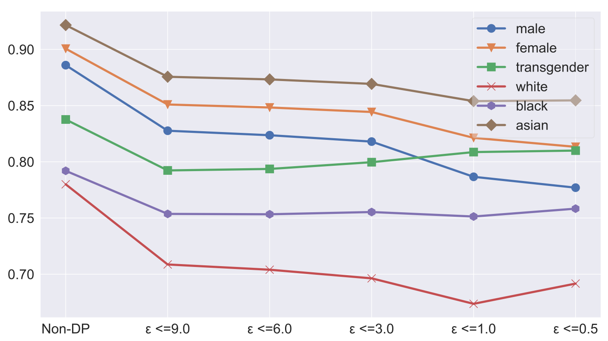
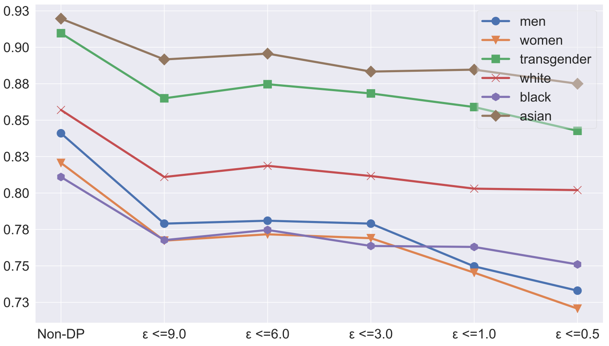
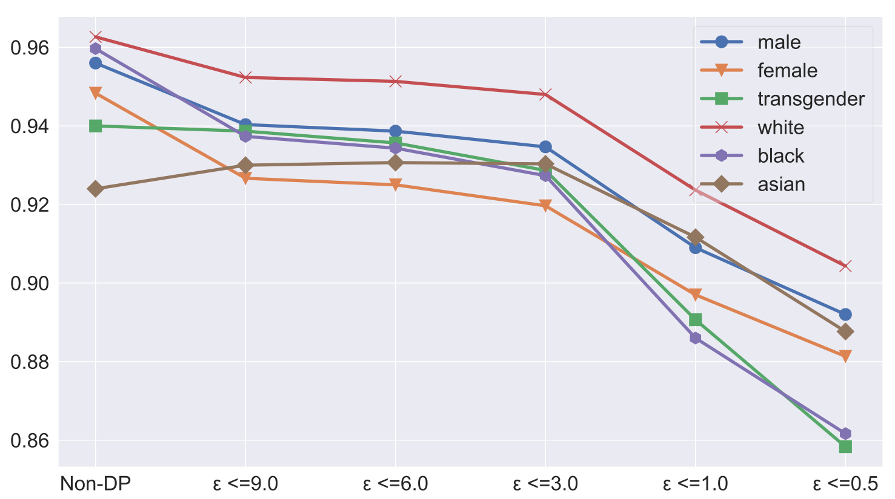
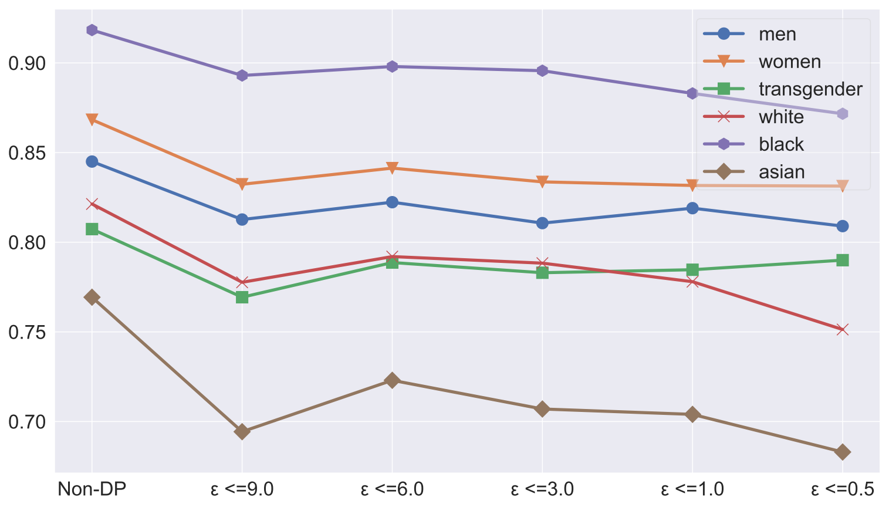
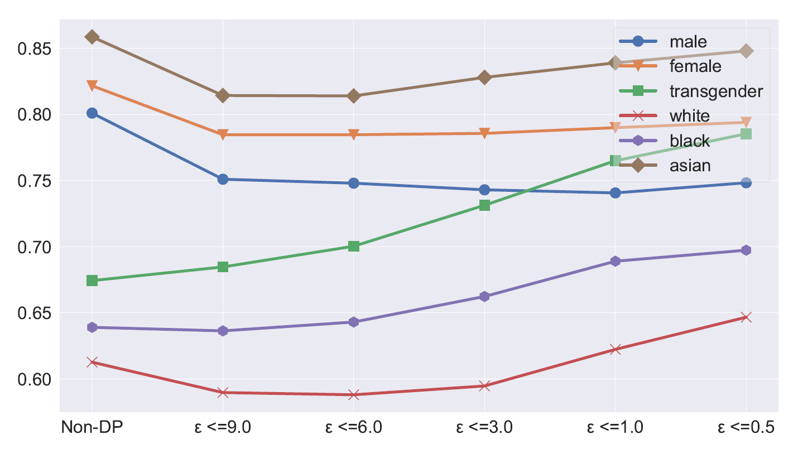
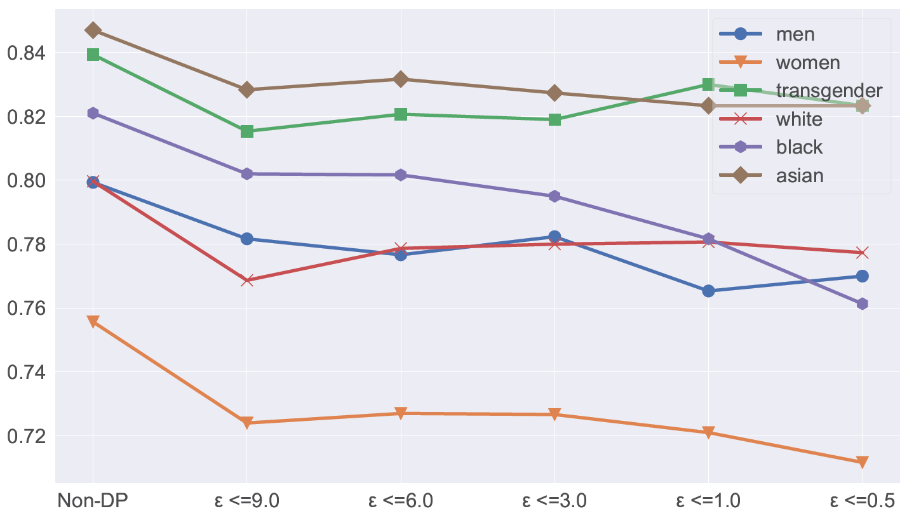
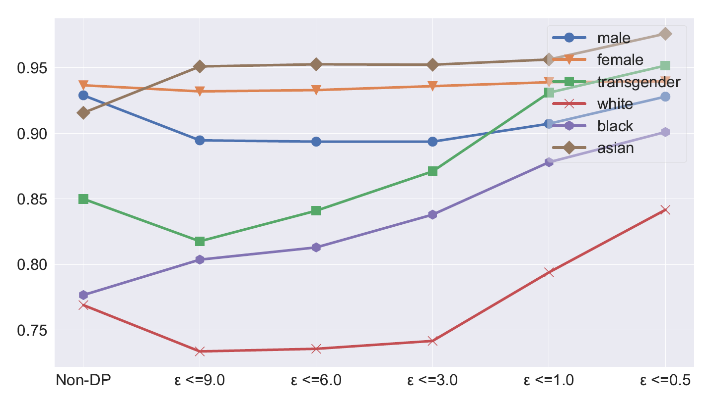
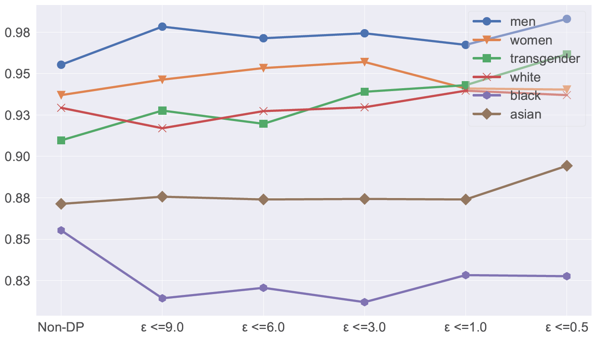

# Evaluating Bias and Robustness of Differentially Private NLP Models

Paper link: [Does Differential Privacy Impact Bias in Pretrained Language Models?](http://sites.computer.org/debull/A24june/p125.pdf) - Bulletin of the IEEE Computer Society Technical Committee on Data Engineering (2023).

## Introduction

In this work we evaluate how differentially private training impacts the Bias in NLP models. We choose two very popular hate speech detection datasets [Jigsaw Unintended Bias](https://www.kaggle.com/competitions/jigsaw-unintended-bias-in-toxicity-classification/overview) by Jigsaw [[1]](#borkan) and [Measuring Hate Speech](https://huggingface.co/datasets/ucberkeley-dlab/measuring-hate-speech) by UCBerkeley [[2]](#reddy). We experiment with different privacy budgets, bias metrics to perform the evaluation. Our experiments show that Differential Privacy (DP) can increase the bias of the NLP model and make it more uncertain about distinguishing the pos/neg examples in the protected groups from others.

## Citation

```bash
@article{islam2023does,
  title={Does Differential Privacy Impact Bias in Pretrained Language Models?},
  author={Islam, Md Khairul and Wang, Andrew and Wang, Tianhao and Ji, Yangfeng and Fox, Judy and Zhao, Jieyu},
  journal={Data Engineering},
  pages={126},
  year={2023}
}
```

## Folder Structure

### results

For each dataset jigsaw, ucberkeley

* average: has the average of multiples runs.
  * model name: bert base uncased
* run _ : bias and overall metrics for each run.
  * model name: bert base uncased
    * normal: non-dp training
    * epsilon budget: trained using specified privacy budget.
      * config.json: config dataclass, used to reproduce the experiment in future.
      * result.csv: output probabilities for train, test, validation.

### src

This folder contains

* tokenizer.py, train.py, private_train.py: generic template python scripts
* train_utils.py, metric_utils.py: common util methods

Inside this, for each dataset there is a different folder that contains

* tokenize dataset using model.ipynb
* tuning on dataset using model.ipynb
* private tuning on dataset using model.ipynb
* benchmark.ipynb: calculate bias and overall results for a single file.
* batch-benchmark.py: calculates benchmarking for all runs and models of a dataset.
* average results and plot.ipynb: average bias and overall results from multiple runs
* preprocess.py: preprocess and split the dataset into train/validation/test split

## Dataset

### Links

* Complete Jigsaw unintented bias data [all_data.csv](https://www.kaggle.com/competitions/jigsaw-unintended-bias-in-toxicity-classification/data?select=all_data.csv)
* UCBerkeley measuring hate speech https://huggingface.co/datasets/ucberkeley-dlab/measuring-hate-speech.

### Protected Attribute

We selected the following protected attributes to analyze:

* gender
* race

Among these protected attributes we investigate the following identity subgroups:

* male/men
* female/women
* transgender
* white
* black
* asian

## Evaluation Metrics

* [Subgroup AUC, BPSN, BNSP](https://www.kaggle.com/competitions/jigsaw-unintended-bias-in-toxicity-classification/overview/evaluation) [[1]](#borkan).
* EOdds, EqOpp1, EqOpp0 [[2]](#reddy).
* Demographic parity, Protected Accuracy [[3]](#hardt)

## Model

[BERT base uncased](https://huggingface.co/bert-base-uncased). We only train the last three layers of the model.

## Privacy Engine

[Opacus](https://opacus.ai/). Used delta=1e-6, epsilon=0.5, 1.0, 3.0, 6.0, 9.0. Maximum gradient norm 1.0. Maximum physical batch size 32.

## Reproduce

### Preprocess

First download the data from the source and link them to the proprocess.py files for each dataset. Each takes a seed to randomize the split, the input output paths, run number etc.

```bash
# check available arguments
python preprocess.py --help

# example for jigsaw
python preprocess.py --seed 2022 --path "experiment" --run 1 --input all_data.csv

# example for ucberkeley
python preprocess.py --seed 2022 --path "experiment" --run 1
```

After running this you should be seeing the train.csv, test.csv and validation.csv inside the output folder.

### Tokenize

This tokenizes the text from train, test, validation files and saves them into pickle format. The generic script [tokenizer.py](src/tokenizer.py) is used for this. You can also use the individual tokenizer notebook in each dataset folder. Make sure to align the input output paths.

```bash
# check available arguments
python tokenizer.py --help

# example for jigsaw
python tokenizer.py --model "bert-base-uncased" --path "jigsaw/experiment/run 1"

# example for ucberkeley
python tokenizer.py --model "bert-base-uncased" --path "ucberkeley/experiment/run 1"
```

### Train

For each run we need to do a normal training using BERT on the dataset using [train.py](src/train.py). The prediction outputs are saved in the results.csv files.

```bash
# check available arguments
python train.py --help

# example for jigsaw
python train.py -p "ucberkeley/experiment/run 1/bert-base-uncased"

# example for ucberkeley
python train.py -p "ucberkeley/experiment/run 1/bert-base-uncased"
```

### DP Training

For each run and privacy budget, we do a DP training on the dataset using [private_train.py](src/private_train.py). The prediction outputs are saved in the results.csv files.

```bash
# check available arguments
python train.py --help

# example for jigsaw
python private_train.py --path "jigsaw/experiment/run 1/bert-base-uncased" --epsilon 1.0

# example for ucberkeley
python private_train.py --path "ucberkeley/experiment/run 1/bert-base-uncased" --epsilon 1.0
```

## Benchmark

Run the `batch_benchmark.py` script in each dataset folder to benchmark all runs. Then use the `average results and plot.ipynb` to plot and save the results. They are saved into the [results](results/) folder for each dataset.

## Results

Our results find that bias degrades for both dataset.This is based on the AUC based metrics.

|Metric | Jigsaw | UCBerkeley |
|:---:|:---:|:---:|
| Background Positive Subgroup Negative |  |   |
| Background Negative Subgroup Positive |  |  | 
| Protected Accuracy |  |  |
| EqualityOdd |  |  |
| Precision | [link](results/jigsaw/average/bert-base-uncased/precision.pdf) | [link](results/ucberkeley/average/bert-base-uncased/precision.pdf) |
| Recall | [link](results/jigsaw/average/bert-base-uncased/recall.pdf) | [link](results/ucberkeley/average/bert-base-uncased/recall.pdf) | 
| Equality Opportunity (1) | [link](results/jigsaw/average/bert-base-uncased/eqOpp1.pdf) | [link](results/ucberkeley/average/bert-base-uncased/eqOpp1.pdf) |
| Equality Opportunity (0) | [link](results/jigsaw/average/bert-base-uncased/eqOpp0.pdf) | [link](results/ucberkeley/average/bert-base-uncased/eqOpp0.pdf) |
| Parity | [link](results/jigsaw/average/bert-base-uncased/parity.pdf) | [link](results/ucberkeley/average/bert-base-uncased/parity.pdf) |

## References

<a id="borkan">[1]</a>
Daniel Borkan, Lucas Dixon, Jeffrey Sorensen, Nithum Thain, and Lucy Vasserman. 2019. Nuanced metrics for measuring unintended bias with real data for text classification.

<a id="reddy">[2]</a>
Charan Reddy, Deepak Sharma, Soroush Mehri, Adriana Romero-Soriano, Samira Shabanian, and Sina Honari. 2021. Benchmarking bias mitigation algorithms in representation learning through fairness
metrics.

<a id="hardt">[3]</a>
Moritz Hardt, Eric Price, and Nati Srebro. 2016. Equality of opportunity in supervised learning.